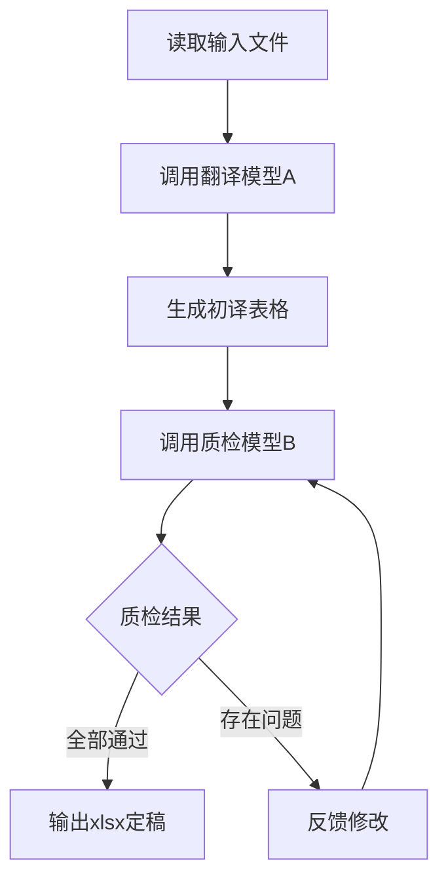

# APP本地化翻译技能

## 功能概述

出海APP小语种本地化翻译工具，采用**双模型交叉质检**机制：
1. **翻译阶段**：调用大模型A进行初译
2. **质检阶段**：调用大模型B进行交叉检测
3. **循环优化**：如有问题则反馈修改，直至质检通过
4. **输出结果**：xlsx格式定稿表格（key、zh、id列）

## 模型配置

| 角色 | 模型 | 模型 ID |
|------|------|---------|
| A模型(翻译) | Ling 3.0 Flash Sante | `inclusionai/ling-3.0-flash-sante:free` |
| B模型(质检) | LongCat 2.0 | `meituan/LongCat-2.0:free` |

**服务商**: Command Code Provider API（OpenAI 兼容）

**API端点**: `https://api.commandcode.ai/provider/v1/chat/completions`

**鉴权**: 请求头 `Authorization: Bearer $COMMANDCODE_API_KEY`。密钥优先读环境变量，读不到才用脚本内兜底值。

### 额度与限速

两个 `:free` 模型均为人人可享的免费额度：**每日每账号 100 次请求，UTC 零点重置**（详见 [Pricing & Limits](https://commandcode.ai/docs/resources/pricing-limits#longcat-2.0-free)）。

单轮翻译消耗 = 1 次 A 模型 + N 次 B 模型，N 取决于质检迭代轮数。批量翻译时按需下调 `--max-iterations`。

> LongCat 2.0 是带思维链的模型，推理内容会占用输出预算。脚本已将 `MAX_TOKENS` 提到 8000，并处理了「正文被推理吃光返回空」的情况；表格很大时请再调高或拆分批次。

## 核心特性

- ✅ 支持多轮循环质检优化
- ✅ 口语化、本土化表达
- ✅ 适配APP UI场景（按钮、弹窗、提示等）
- ✅ 严格保持Key对应关系，不乱序不漏行
- ✅ 保持 %1$s 等占位符逐字不变（改了 APP 会崩）
- ✅ 输出xlsx格式定稿表格
- ✅ 保持原始key和zh列不变

## 使用方法

### 命令行调用

```bash
python scripts/translate.py --input 翻译原文.xlsx --target-lang "日语"
```

### 参数说明

| 参数 | 必填 | 说明 |
|------|------|------|
| `--input` | 是 | 输入文件路径（支持xlsx/csv） |
| `--target-lang` | 是 | 目标翻译语言 |
| `--output` | 否 | 输出文件路径，默认xlsx格式 |
| `--max-iterations` | 否 | 最大质检循环次数，默认3次 |

### 输入文件格式

xlsx或csv文件需包含以下列：
- `key`: 字符串标识符
- `zh`: 待翻译的中文文本

### 输出文件格式

xlsx格式，包含以下列：
- `key`: 原始Key值（保持不变）
- `zh`: 原始中文内容（保持不变）
- `id`: 目标语言定稿译文

## 工作流程



## 依赖要求

运行环境：`/Users/xuzp/.workbuddy/binaries/python/envs/default/bin/python`

```bash
pip install pandas openpyxl requests
```

密钥建议写入环境变量，避免硬编码进仓库：

```bash
export COMMANDCODE_API_KEY="user_..."
```

## 示例运行

```bash
# 翻译为日语
python scripts/translate.py --input 翻译原文.xlsx --target-lang "日语"

# 翻译为泰语，并指定输出文件名
python scripts/translate.py --input 翻译原文.xlsx --target-lang "泰语" --output thai.xlsx
```
